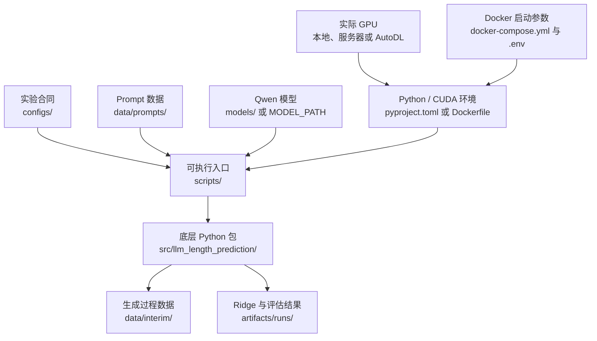

# LLM Length Prediction

面向大模型推理服务的输出长度预测研究。项目首先使用 ALPS 方法，在回答生成前从 Qwen
的中间隐藏状态预测最终输出长度；后续再加入 PLP，在生成过程中利用 entropy、EOS
probability 等信号持续修正剩余长度。

预测结果最终用于评估 batching、延迟、KV-cache 规划和长输出低估风险，而不仅仅是比较
MAE。

## 当前状态

| 模块 | 状态 | 说明 |
|---|---|---|
| Prompt 数据集 | 已完成 | 60 个 family、180 个 Prompt、固定 80/20 Train/Test |
| Hugging Face trace 采集 | 代码完成，待 GPU pilot | 支持 Layer 14、entropy、EOS probability、严格断点续跑 |
| ALPS Ridge prior | 代码与合成流程已验证 | `StandardScaler + Ridge(alpha=1.0)`；待真实 Qwen trace |
| PLP 动态修正 | 尚未实现 | `train_dynamic.py` 目前是占位入口 |
| Serving benchmark | 尚未实现 | `run_benchmark.py` 目前是占位入口 |

当前应先完成 **ALPS v1**。不要把尚未实现的 PLP 或 serving benchmark 当作已经可运行的
功能。非 GPU 数据合同、Train/Test 完整性、Ridge 训练和评估已经通过自动化测试；真实
Qwen + RTX 5090 仍必须以 `preflight_server.py` 和 6 条 pilot 作为最终部署验收。

## 系统架构

正常使用时，从项目根目录运行 `scripts/` 中的命令。脚本读取冻结实验配置、Prompt 和
Qwen 模型，调用 `src/` 中的实现，最后生成 trace、Ridge 模型和评估结果。



这里有三个容易混淆的边界：

- `configs/` 决定实验条件，不决定实际显卡型号。
- GPU 由本地机器、服务器或 AutoDL 提供；PyTorch/CUDA 决定代码能否使用它。
- `models/`、`data/interim/` 和 `artifacts/runs/` 包含机器本地的大文件，不提交 Git。

## ALPS v1 运行流程

以下命令都应在项目根目录执行。

### 1. 安装项目

已有兼容的 PyTorch/CUDA 环境时，正式实验使用锁定的非 PyTorch 依赖，同时保留机器镜像
提供的 CUDA-enabled PyTorch：

```bash
python -m pip install --requirement requirements-autodl.lock
python -m pip install --no-deps --editable .
```

`pyproject.toml` 定义最低依赖范围；`requirements-autodl.lock` 只固定 AutoDL
直接 Python 方案使用的非 PyTorch 依赖。

两种部署方式是并列的：

- 学校 RTX 4090 服务器：保留原有 `Dockerfile`、`docker-compose.yml`、`.env`
  和 `requirements-docker.lock`，按
  [`docs/docker_4090_runbook.md`](docs/docker_4090_runbook.md) 运行。
- AutoDL RTX 5090：不使用上述 Docker 镜像，选择 CUDA 12.8 兼容的 PyTorch
  镜像后直接运行 Python，按
  [`docs/autodl_5090_runbook.md`](docs/autodl_5090_runbook.md) 操作。

### 2. 准备冻结模型

模型固定为：

```text
Qwen/Qwen2.5-7B-Instruct
revision: a09a35458c702b33eeacc393d103063234e8bc28
```

模型可以放在：

```text
models/Qwen2.5-7B-Instruct/
```

也可以放在机器的其他磁盘，并设置：

```bash
export MODEL_PATH=/absolute/path/to/Qwen2.5-7B-Instruct
```

使用 `python scripts/download_model.py` 下载指定 revision。下载方法、`.frozen_revision`
文件和模型解析顺序见
[`models/README.md`](models/README.md)。

### 3. 检查环境

```bash
python scripts/preflight_server.py
```

它会检查模型版本、Prompt hash、CUDA、BF16、显存、磁盘和输出目录。

### 4. 先跑 6 条 pilot

```bash
python scripts/collect_dataset.py --splits train --limit 6
```

确认显存、运行时间、stop reason、输出长度和 Layer 14 特征均正常后，再继续完整训练集。

### 5. 采集 Train 并训练 Ridge

```bash
python scripts/collect_dataset.py --splits train
python scripts/train_prior.py
python scripts/evaluate_prior.py --split train
```

训练采集包含 144 个 Train Prompt，每个 Prompt 使用 seeds `42/43/44`，共 432 个
rollout。采集可以断点续跑。

### 6. 最后才打开 Test

只有在模型、alpha、指标和分析方式全部冻结后才执行：

```bash
python scripts/collect_dataset.py --splits test --confirm-final-test
python scripts/evaluate_prior.py --split test --confirm-final-test
```

Test 包含 36 个 Prompt、108 个 rollout。`--confirm-final-test` 用于防止开发过程中反复
查看最终测试结果。

完整脚本说明见 [`scripts/README.md`](scripts/README.md)。

## 数据流与输出

```text
data/prompts/alps_v1_prompts.jsonl
                |
                v
      collect_dataset.py + Qwen
                |
                v
data/interim/alps_v1/{train,test}/
                |
                v
          train_prior.py
                |
                v
artifacts/runs/alps_v1/stage1/
```

主要输出：

| 路径 | 内容 |
|---|---|
| `data/interim/alps_v1/` | 每个 `(prompt_id, seed)` 的生成 trace |
| `artifacts/runs/alps_v1/collection_index.jsonl` | trace 路径、checksum 和运行元数据 |
| `artifacts/runs/alps_v1/stage1/prior.json` | Scaler、Ridge 权重、偏置和残差方差 |
| `artifacts/runs/alps_v1/stage1/metrics.json` | 训练阶段指标 |
| `artifacts/runs/alps_v1/stage1/predictions.csv` | 真实长度与预测长度 |

## 冻结实验条件

机器可读的正式合同是
[`configs/experiments/alps_v1_manifest.json`](configs/experiments/alps_v1_manifest.json)。

| 条件 | ALPS v1 固定值 |
|---|---|
| 模型 | `Qwen/Qwen2.5-7B-Instruct`，固定 revision |
| 精度 | BF16；4-bit 只允许用于调试 |
| 特征 | zero-based Transformer block 14，最后一个 Prompt token |
| Temperature / Top-p | `0.7` / `0.95` |
| Max new tokens | `4096`，输出长度包含 EOS |
| Seeds | `[42, 43, 44]` |
| 数据划分 | 按 prompt family 固定 80% Train / 20% Test |
| Ridge | Train-only StandardScaler，`alpha=1.0` |
| 目标 | `log1p(output_tokens)`，shifted log-normal prior |
| Qwen 权重 | 完全冻结 |

`base.yaml` 和各 stage YAML 当前主要用于记录设计；正式 ALPS v1 脚本直接读取 JSON
manifest。具体区别见 [`configs/README.md`](configs/README.md)。

## 目录导航

| 目录 | 作用 | 详细说明 |
|---|---|---|
| `configs/` | 实验合同与阶段配置 | [`configs/README.md`](configs/README.md) |
| `scripts/` | 用户实际运行的命令 | [`scripts/README.md`](scripts/README.md) |
| `src/` | 采集、数据、Ridge 和评估底层实现 | [`src/README.md`](src/README.md) |
| `data/` | 固定 Prompt 与本地生成 trace | [`data/README.md`](data/README.md) |
| `models/` | 本地 Qwen 模型挂载点 | [`models/README.md`](models/README.md) |
| `artifacts/` | Ridge、预测和评估结果 | [`artifacts/README.md`](artifacts/README.md) |
| `docs/` | 研究计划与部署手册 | [`docs/README.md`](docs/README.md) |
| `tests/` | 数据合同和数学实现测试 | [`tests/README.md`](tests/README.md) |
| `notebooks/` | 探索性分析，不放正式流程 | [`notebooks/README.md`](notebooks/README.md) |

## 开发检查

```bash
python -m pytest
python -m ruff check .
```

单元测试不会加载 7B 模型，也不能替代 GPU pilot。真实 GPU、BF16、模型文件和磁盘条件
由 `preflight_server.py` 检查。

## 研究路线

项目计划分为四个阶段：ALPS 静态 prior、PLP 动态修正、端到端 serving benchmark 和
错误反馈分析。研究问题、对比方法和后续里程碑见
[`docs/research_plan.md`](docs/research_plan.md)。
