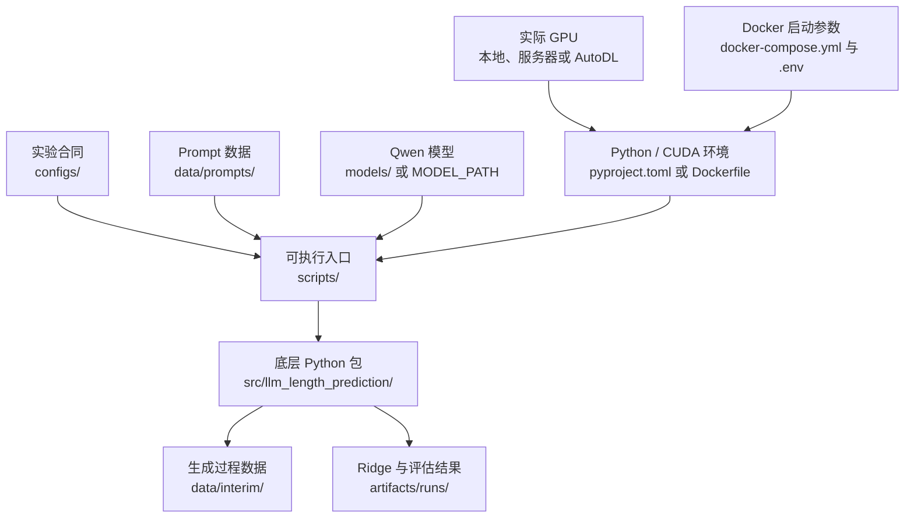

# LLM Length Prediction

面向大模型推理服务的输出长度预测研究。项目使用 ALPS 在回答生成前预测最终输出长度，
并使用 PLP 在回答生成过程中持续预测剩余长度。

> **版本边界：**已跑完的 **Dynamic-Signal MLP v1** 只使用五个动态标量，是工程 baseline，
> 不是论文 PLP。新实现的 **Hidden-State PLP v2** 使用 entropy-guided Prompt 表征、解码期
> 最终层隐藏状态和 20-bin soft-label 预测头；它是 PLP-only，不读取 ALPS prior。v2 代码已
> 完成，但必须重新采集 hidden-state trace，当前还没有实验结果。

预测结果最终用于评估 batching、延迟、KV-cache 规划和长输出低估风险，而不仅仅是比较
MAE。

## 当前状态

| 模块 | 状态 | 说明 |
|---|---|---|
| Prompt 数据集 | 已完成 | 60 个 family、180 个 Prompt、固定 80/20 Train/Test |
| Hugging Face trace 采集 | 已完成 | AutoDL 已采集 432 Train + 108 Test rollout |
| ALPS Ridge prior | v1 主实验已完成 | 固定 Layer 14、`StandardScaler + Ridge(alpha=1.0)` |
| ALPS 五折验证 | 已完成 | OOF MAE `60.87`、Log R² `0.953`，固定配置不选择参数 |
| 输入长度 Ridge baseline | 已完成 | Test MAE `246.77`、Log R² `0.011`，预测力很弱 |
| Dynamic-Signal MLP v1 | 已完成 | Test sequence-balanced MAE `136.66`、Raw R² `0.089`，仅中段有一定能力 |
| Hidden-State PLP v2 | 代码已完成，尚未运行 | 论文对齐、非精确复现；需重新生成并采集 Prompt/Decode 最终层 hidden state |
| Serving benchmark | 尚未实现 | `run_benchmark.py` 目前是占位入口 |

当前 ALPS v1 的采集、最终 Ridge、Train/Test 分组分析、固定五折、输入长度 baseline 和
Dynamic-Signal MLP v1 均已完成。ALPS 点预测泛化能力较强，但概率区间欠校准；输入 token
baseline 很弱；Dynamic-Signal MLP 呈现早期低估、后期高估。Hidden-State PLP v2 已具备
采集、训练和评估入口，尚未在 GPU 上运行。v1 完整汇总见
[`docs/results/v1/README.md`](docs/results/v1/README.md)。Serving benchmark 仍未实现。

## 系统架构

正常使用时，从项目根目录运行 `scripts/` 中的命令。脚本读取冻结实验配置、Prompt 和
Qwen 模型，调用 `src/` 中的实现，最后生成 trace、Ridge 模型和评估结果。


```mermaid
flowchart TD
    CONFIG["实验合同<br/>configs/"] --> SCRIPTS["可执行入口<br/>scripts/"]
    PROMPTS["Prompt 数据<br/>data/prompts/"] --> SCRIPTS
    MODEL["Qwen 模型<br/>models/ 或 MODEL_PATH"] --> SCRIPTS

    GPU["实际 GPU<br/>本地、服务器或 AutoDL"] --> ENV["Python / CUDA 环境<br/>pyproject.toml 或 Dockerfile"]
    DOCKER["Docker 启动参数<br/>docker-compose.yml 与 .env"] --> ENV
    ENV --> SCRIPTS

    SCRIPTS --> SRC["底层 Python 包<br/>src/llm_length_prediction/"]
    SRC --> TRACES["生成过程数据<br/>data/interim/"]
    SRC --> RESULTS["Ridge 与评估结果<br/>artifacts/runs/"]
```

这里有几个容易混淆的边界：

- `configs/` 决定实验条件，不决定实际显卡型号。
- `configs/experiments/` 保存机器可读实验合同，不是实验结果目录。
- `artifacts/runs/` 保存本机生成的原始模型与指标；`docs/results/` 保存可提交的结果报告。
- GPU 由本地机器、服务器或 AutoDL 提供；PyTorch/CUDA 决定代码能否使用它。
- `models/`、`data/interim/` 和 `artifacts/runs/` 包含机器本地的大文件，不提交 Git。

## ALPS v1 运行流程

以下命令都应在项目根目录执行。

### 1. 安装项目

已有兼容的 PyTorch/CUDA 环境时，正式实验使用锁定的非 PyTorch 依赖，同时保留机器镜像
提供的 CUDA-enabled PyTorch：

```bash
python -m pip install --requirement requirements-autodl.lock
python -m pip install --no-deps --editable .
```

`pyproject.toml` 定义最低依赖范围；`requirements-autodl.lock` 只固定 AutoDL
直接 Python 方案使用的非 PyTorch 依赖。

两种部署方式是并列的：

- 学校 RTX 4090 服务器：保留原有 `Dockerfile`、`docker-compose.yml`、`.env`
  和 `requirements-docker.lock`，按
  [`docs/deployment/docker_4090.md`](docs/deployment/docker_4090.md) 运行。
- AutoDL RTX 5090：不使用上述 Docker 镜像，选择 CUDA 12.8 兼容的 PyTorch
  镜像后直接运行 Python，按
  [`docs/deployment/autodl_5090.md`](docs/deployment/autodl_5090.md) 操作。

### 2. 准备冻结模型

模型固定为：

```text
Qwen/Qwen2.5-7B-Instruct
revision: a09a35458c702b33eeacc393d103063234e8bc28
```

模型可以放在：

```text
models/Qwen2.5-7B-Instruct/
```

也可以放在机器的其他磁盘，并设置：

```bash
export MODEL_PATH=/absolute/path/to/Qwen2.5-7B-Instruct
```

使用 `python scripts/download_model.py` 下载指定 revision。下载方法、`.frozen_revision`
文件和模型解析顺序见
[`models/README.md`](models/README.md)。

### 3. 检查环境

```bash
python scripts/preflight_server.py
```

它会检查模型版本、Prompt hash、CUDA、BF16、显存、磁盘和输出目录。

### 4. 先跑 6 条 pilot

```bash
python scripts/collect_dataset.py --splits train --limit 6
```

确认显存、运行时间、stop reason、输出长度和 Layer 14 特征均正常后，再继续完整训练集。

### 5. 采集 Train

```bash
python scripts/collect_dataset.py --splits train
```

训练采集包含 144 个 Train Prompt，每个 Prompt 使用 seeds `42/43/44`，共 432 个
rollout。采集可以断点续跑。

### 6. 用固定条件进行五折验证

在训练最终 Ridge 前，按照 `prompt_family_id` 进行五折交叉验证。Layer 14 和
`alpha=1.0` 均直接读取冻结 manifest；该步骤只检查固定配置在未见 family 上的泛化能力，
并与简单 baseline 对照，不扫描或选择超参数：

```bash
python scripts/evaluate_grouped_cv.py
```

五折产生的临时 Ridge 只用于验证，随后全部丢弃。

### 7. 使用全部 Train 一次性训练最终 Ridge

```bash
python scripts/train_prior.py
python scripts/evaluate_prior.py --split train
```

`train_prior.py` 使用全部 432 条 Train rollout 重新拟合 StandardScaler 和一个最终 Ridge，
并写入 `artifacts/runs/alps_v1/stage1/prior.json`。

### 8. 最后才打开 Test

只有在模型、alpha、指标和分析方式全部冻结后才执行：

```bash
python scripts/collect_dataset.py --splits test --confirm-final-test
python scripts/evaluate_prior.py --split test --confirm-final-test
```

Test 包含 36 个 Prompt、108 个 rollout。`--confirm-final-test` 用于防止开发过程中反复
查看最终测试结果。现有 v1 Test 已经打开；补做五折验证不得用于修改 v1 后再次测试。

### 9. 离线生成分组分析

Train/Test 的逐条预测完成后，不需要再次加载 Qwen、生成 rollout 或训练 Ridge。下面的
命令读取现有 `*_evaluation.csv` 和冻结 Prompt manifest，在 CPU 上生成完整分组报告：

```bash
python scripts/analyze_prior.py \
  --splits train test \
  --confirm-final-test
```

报告保留总体指标，并增加：

- `short` / `medium` / `long`；
- `qa` / `summarization` / `code`；
- 3×3 任务—长度交叉组和三个 seed；
- Raw R² 与 Log R²；
- 先对同一 Prompt 的三个 seed 实际长度求均值，再评价ALPS点预测；
- 同一 `prompt_family_id` 下 Short→Medium→Long 的单调性和长度增量误差；
- rollout-level NLL/Coverage与prompt-mean点预测分开报告。

`intended_length` 是实验预先设定的 Prompt 条件，不是根据 Test 输出事后切分的长度箱。
九宫格 Test 单元只有 4 个独立 family（12 个 rollout），所以单元内 R² 应结合 MAE、
Bias、Coverage 和样本量一起解释。

完整脚本说明见 [`scripts/README.md`](scripts/README.md)。

### 10. 运行输入长度 baseline 与 Dynamic-Signal MLP v1

两者都直接读取已有 `data/interim/alps_v1/`，不加载 Qwen、不重新生成回答：

```bash
# prompt_tokens -> output_tokens 的 Ridge baseline
python scripts/train_input_baseline.py
python scripts/evaluate_input_baseline.py --split test --confirm-final-test

# decode-time signals -> remaining_tokens 的 Dynamic-Signal MLP v1
python scripts/train_dynamic.py
python scripts/evaluate_dynamic.py --split test --confirm-final-test
```

Dynamic-Signal MLP v1 的冻结合同位于
[`configs/experiments/plp_v1_manifest.json`](configs/experiments/plp_v1_manifest.json)。
它固定使用 step、entropy、entropy rolling mean/slope 和 EOS probability，每 5 token
更新一次；不读取 ALPS prior 或任何 hidden state。其完整定义、9089 个参数的计算方式、
冻结训练条件、实验结果和论文边界见
[`docs/results/v1/dynamic_signal_mlp.md`](docs/results/v1/dynamic_signal_mlp.md)。

现有 v1 Test 已经用于 ALPS 开发后的分析，因此新增比较方法在该 Test 上属于事后对照。
不得根据这些 Test 指标继续调参；严格的最终结论需要下一轮新 holdout。

### 11. 运行真正的 Hidden-State PLP v2

旧 ALPS trace 没有保存生成 token 的隐藏状态，因此 v2 **不能只重跑评估**，必须让 Qwen
按相同 Prompt、temperature、top-p 和 seeds 再生成一次。先只做 Train pilot：

```bash
python scripts/collect_plp_dataset.py --splits train --limit 6
```

确认 `data/interim/plp_v2/` 出现 `.npz` 文件后，完成 Train、训练预测头并评价 Train：

```bash
python scripts/collect_plp_dataset.py --splits train
python scripts/train_plp.py
python scripts/evaluate_plp.py --split train
```

最后再采集和评价 Test：

```bash
python scripts/collect_plp_dataset.py --splits test --confirm-final-test
python scripts/evaluate_plp.py --split test --confirm-final-test
```

PLP v2 固定使用最终 Transformer 层。每个预测点输入为：

```text
[entropy-guided pooled Prompt final-layer state ;
 current generated token final-layer causal state]
```

当前 token 的 causal state 已经注意到此前生成的全部 token。论文写的是把 Prompt 表征与
此前生成状态“简单拼接”，但公开仓库目前没有 PLP 源码，也没有说明可变长拼接如何进入固定
维度预测头；因此本项目把它冻结为上述固定维度解释，并在
[`configs/experiments/plp_v2_manifest.json`](configs/experiments/plp_v2_manifest.json)
明确标记为 paper-aligned、non-exact replication。训练头采用论文的 20 bins、
`CE + MSE`、`lambda=0.95`、AdamW、learning rate `2e-5`、10 epochs、batch size 16、seed 42。
完整方法说明见
[`docs/methods/plp_only_explained.md`](docs/methods/plp_only_explained.md)；实验合同和运行边界见
[`docs/planning/hidden_state_plp_v2.md`](docs/planning/hidden_state_plp_v2.md)。

本轮继续复用已经打开过的 v1 Test，所以将来得到的 v2 Test 数字只能作为开发性对照；严格
确认性结论仍需要新的 family-level holdout。

本轮 ALPS、baseline 与 Dynamic-Signal MLP 的统一结果见
[`docs/results/v1/README.md`](docs/results/v1/README.md)。ALPS 的分组结果、五折
泛化判断和预测区间校准问题统一见
[`docs/results/v1/alps.md`](docs/results/v1/alps.md)，后续校准实施步骤见
[`docs/planning/alps_improvement_plan.md`](docs/planning/alps_improvement_plan.md)。

## 数据流与输出

```text
data/prompts/alps_v1_prompts.jsonl
                |
                v
      collect_dataset.py + Qwen
                |
                v
data/interim/alps_v1/{train,test}/
                |
                +----> evaluate_grouped_cv.py
                |              |
                |              v
                |     diagnostics/grouped_cv/
                |
                +----> train_prior.py ----------> stage1/
                |
                +----> train_input_baseline.py -> comparisons/input_token_ridge/
                |
                `----> train_dynamic.py --------> comparisons/plp_only/

data/prompts/alps_v1_prompts.jsonl + Qwen
                |
                `----> collect_plp_dataset.py --> data/interim/plp_v2/
                                      |
                                      `----> train_plp.py --> artifacts/runs/plp_v2/
```

主要输出：

| 路径 | 内容 |
|---|---|
| `data/interim/alps_v1/` | 每个 `(prompt_id, seed)` 的生成 trace |
| `artifacts/runs/alps_v1/collection_index.jsonl` | trace 路径、checksum 和运行元数据 |
| `artifacts/runs/alps_v1/stage1/prior.json` | Scaler、Ridge 权重、偏置和残差方差 |
| `artifacts/runs/alps_v1/stage1/metrics.json` | 训练阶段指标 |
| `artifacts/runs/alps_v1/stage1/predictions.csv` | 真实长度与预测长度 |
| `artifacts/runs/alps_v1/stage1/{train,test}_breakdown.json` | 总体、长度、任务、交叉组、seed和配对长度分析 |
| `artifacts/runs/alps_v1/stage1/{train,test}_breakdown.csv` | 适合表格和绘图的分组指标 |
| `artifacts/runs/alps_v1/stage1/{train,test}_breakdown.md` | 可直接阅读的完整分组表格 |
| `artifacts/runs/alps_v1/stage1/{train,test}_prompt_mean_breakdown.csv` | 三seed均值后的Prompt级点预测 |
| `artifacts/runs/alps_v1/stage1/{train,test}_length_contrasts.csv` | Short→Medium→Long配对变化 |
| `artifacts/runs/alps_v1/comparisons/input_token_ridge/` | 输入 token Ridge 模型与 Train/Test 结果 |
| `artifacts/runs/alps_v1/comparisons/plp_only/` | Dynamic-Signal MLP v1、训练记录和按解码进度分组结果 |
| `data/interim/plp_v2/` | Hidden-State PLP v2 的压缩 NPZ trace；包含 Prompt pooled state 与解码 hidden states |
| `artifacts/runs/plp_v2/` | PLP v2 checkpoint、训练记录、Train/Test 总体和分进度结果 |

## 冻结实验条件

机器可读的正式合同是
[`configs/experiments/alps_v1_manifest.json`](configs/experiments/alps_v1_manifest.json)。

| 条件 | ALPS v1 固定值 |
|---|---|
| 模型 | `Qwen/Qwen2.5-7B-Instruct`，固定 revision |
| 精度 | BF16；4-bit 只允许用于调试 |
| 特征 | zero-based Transformer block 14，最后一个 Prompt token |
| Temperature / Top-p | `0.7` / `0.95` |
| Max new tokens | `4096`，输出长度包含 EOS |
| Seeds | `[42, 43, 44]` |
| 数据划分 | 按 prompt family 固定 80% Train / 20% Test |
| Ridge | Train-only StandardScaler，`alpha=1.0` |
| 目标 | `log1p(output_tokens)`，shifted log-normal prior |
| Qwen 权重 | 完全冻结 |

`base.yaml` 和各 stage YAML 当前主要用于记录设计；正式 ALPS v1 脚本直接读取 JSON
manifest。具体区别见 [`configs/README.md`](configs/README.md)。

## 目录导航

| 目录 | 作用 | 详细说明 |
|---|---|---|
| `configs/` | 实验合同与阶段配置 | [`configs/README.md`](configs/README.md) |
| `scripts/` | 用户实际运行的命令 | [`scripts/README.md`](scripts/README.md) |
| `src/` | 采集、数据、Ridge 和评估底层实现 | [`src/README.md`](src/README.md) |
| `data/` | 固定 Prompt 与本地生成 trace | [`data/README.md`](data/README.md) |
| `models/` | 本地 Qwen 模型挂载点 | [`models/README.md`](models/README.md) |
| `artifacts/` | Ridge、预测和评估结果 | [`artifacts/README.md`](artifacts/README.md) |
| `docs/` | 方法解释、已完成结果、未来计划、部署手册与参考资料 | [`docs/README.md`](docs/README.md) |
| `tests/` | 数据合同和数学实现测试 | [`tests/README.md`](tests/README.md) |
| `notebooks/` | 探索性分析，不放正式流程 | [`notebooks/README.md`](notebooks/README.md) |

## 开发检查

```bash
python -m pytest
python -m ruff check .
```

单元测试不会加载 7B 模型，也不能替代 GPU pilot。真实 GPU、BF16、模型文件和磁盘条件
由 `preflight_server.py` 检查。

## 研究路线

项目计划分为四个阶段：ALPS 静态 prior、动态剩余长度预测、端到端 serving benchmark 和
错误反馈分析。Dynamic-Signal MLP v1 是已完成的标量 baseline；Hidden-State PLP v2 是
已实现、待 GPU 采集和训练的真正 PLP-only 路线。
研究问题、对比方法和后续里程碑见
[`docs/planning/research_plan.md`](docs/planning/research_plan.md)。
