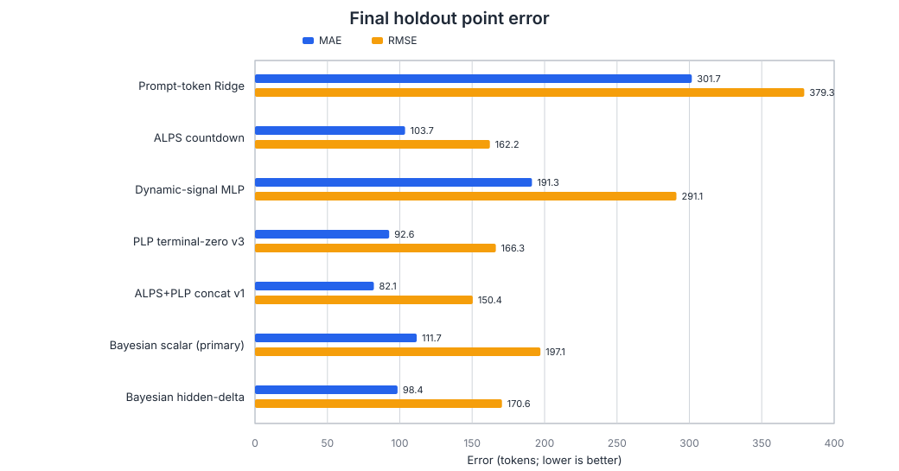
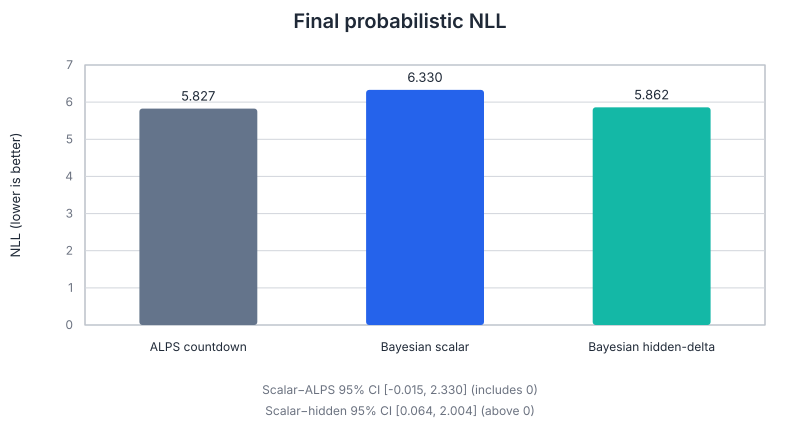
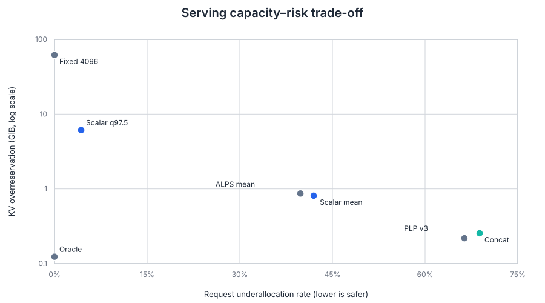

# Bayesian Sequential Stage-8 一次性最终盲测

## 0. 结论边界

2026-08-16 在合并后的 Stage-8B ready lock 上一次性采集 12 个全新 family、36 条 Prompt、
324 条 Qwen2.5-7B-Instruct trace，并运行冻结的七方法最终 benchmark。全部 trace 以 EOS
结束，censoring rate 为 `0`；最终报告、嵌套文件 manifest、压缩包外层 SHA-256 和内部
353 个文件均通过复验。

`status=pass` 表示采集、哈希、指标和边界完整，不表示预注册主方法获得最优指标。Final
holdout 没有选择模型、调阈值或触发 refit；本文中的 paired-family bootstrap 只作描述性
推断，不能把 final 结果改写成新的选型规则。

## 1. 总体结果

| Method | NLL | MAE | RMSE | Bias | Raw R² |
|---|---:|---:|---:|---:|---:|
| Prompt-token Ridge | — | 301.66 | 379.34 | 27.82 | -0.526 |
| ALPS countdown | 5.8265 | 103.67 | 162.19 | 19.88 | 0.558 |
| Dynamic-signal MLP | — | 191.28 | 291.05 | 5.11 | -0.120 |
| PLP terminal-zero v3 | — | 92.64 | 166.30 | -29.95 | 0.528 |
| ALPS+PLP concat v1 | — | 82.06 | 150.38 | -28.90 | 0.576 |
| Bayesian scalar (primary) | 6.3301 | 111.69 | 197.11 | -57.97 | 0.251 |
| Bayesian hidden-delta | 5.8621 | 98.44 | 170.55 | -25.21 | 0.444 |

预注册 primary `bayesian_entropy_scalar_v1` 的 NLL `6.3301`、
MAE `111.69`、RMSE
`197.11`，没有优于 ALPS 的
`5.8265` / `103.67` /
`162.19`。最终测试集上的最低点预测 MAE 来自冻结 baseline
`alps_plp_concat_v1`（`82.06`），但 final holdout
明确不重新选择它。

## 2. 概率质量与 paired-family 证据

| Method | NLL | CRPS | 50% cov. | 90% cov. | 95% cov. |
|---|---:|---:|---:|---:|---:|
| ALPS countdown | 5.8265 | 70.84 | 51.23% | 86.76% | 90.34% |
| Bayesian scalar (primary) | 6.3301 | 86.69 | 41.96% | 76.47% | 82.50% |
| Bayesian hidden-delta | 5.8621 | 73.16 | 49.12% | 83.57% | 89.11% |

| Paired family comparison (left − right) | Estimate | 95% CI | Excludes 0 |
|---|---:|---:|---:|
| scalar minus alps posterior nll | 0.94 | [-0.02, 2.33] | No |
| scalar minus hidden posterior nll | 0.87 | [0.06, 2.00] | Yes |
| scalar minus prompt token ridge countdown absolute error | -105.45 | [-146.15, -67.18] | Yes |
| scalar minus dynamic signal mlp v1 absolute error | -92.11 | [-126.46, -53.95] | Yes |
| scalar minus plp terminal zero v3 absolute error | 28.84 | [-1.05, 63.25] | No |
| scalar minus alps plp concat v1 absolute error | 41.79 | [16.35, 70.58] | Yes |

scalar−ALPS NLL 的 family-bootstrap 95% CI 为
`[-0.015, 2.330]`，跨过 0，所以不能声称两者存在确定的
总体差异。scalar−hidden-delta NLL CI 为
`[0.064, 2.004]`，完全大于 0，描述性证据支持
hidden-delta 的概率表现优于预注册 scalar。scalar−concat absolute-error CI 为
`[16.35, 70.58]`，也完全大于 0。

## 3. 任务差异

| Task | ALPS MAE | Scalar MAE | Hidden-delta MAE | Concat MAE |
|---|---:|---:|---:|---:|
| code | 165.45 | 220.06 | 179.39 | 148.61 |
| qa | 101.26 | 74.47 | 74.85 | 64.44 |
| summarization | 44.29 | 40.55 | 41.08 | 33.14 |

scalar 的主要失效集中在 code：code MAE
`220.06`，而 ALPS 为
`165.45`。因此总体负结果不能
只解释成均匀的小幅退化；新的程序生成 family 暴露了明显的跨任务泛化问题。由于这些是 final
holdout 观察，只能记录为后续独立研究假设，不能在当前实验上修补模型。

## 4. 严格 5% 稳定收敛

324 条序列中只有 `49` 条满足“进入 5% 相对误差后所有后续保存点均
保持在阈值内”，成功率 `15.12%`。成功样本的平均稳定进度为
`91.36%`，median step
`1110`。这不支持“动态 posterior 很早
稳定”的强主张；它更多是在接近输出末端时收敛。

## 5. Serving replay：容量与风险

| Policy | Throughput tok/s | Underallocation | Overreserve/output | KV GiB |
|---|---:|---:|---:|---:|
| oracle observed length | 310.56 | 0.00% | 1.38% | 0.124 |
| max new tokens 4096 | 261.66 | 0.00% | 692.33% | 61.930 |
| alps countdown mean | 309.15 | 39.81% | 9.69% | 0.866 |
| plp terminal zero v3 | 307.17 | 66.36% | 2.44% | 0.219 |
| alps plp concat v1 | 307.29 | 68.83% | 2.85% | 0.255 |
| bayesian entropy scalar v1 mean | 310.27 | 41.98% | 9.06% | 0.811 |
| bayesian entropy scalar v1 q975 | 307.47 | 4.32% | 68.35% | 6.114 |

scalar posterior mean 的 underallocation rate 为
`41.98%`；使用冻结
q97.5 上界后降到
`4.32%`，但 KV
overreservation 从
`0.811`
GiB 增至
`6.114`
GiB。贝叶斯输出的可复现实用价值主要是把不确定性转成显式容量—风险旋钮，而不是证明
posterior mean 点预测最优。

## 6. 最终回答

本项目已经完成导师所要求的两部分：ALPS 作为静态概率先验，解码期间使用非重叠增量证据递归
更新动态 posterior；实现、真实 Qwen trace、family-grouped OOF、冻结模型和全新 family 的一次性
final holdout 均已验证。因此“贝叶斯序列推断尚未实现”这一工程缺口已经补齐。

最终盲测同时给出一个重要负结果：**预注册 Bayesian scalar 的总体泛化优势没有得到支持。**
hidden-delta 在概率 NLL 上优于 scalar，concat baseline 在点误差上最好，而 scalar 的主要问题是
code family 和较晚的稳定收敛。当前可支持的主张是“贝叶斯序列推断已实现，并提供可用的不确定性
与容量风险控制”，不能写成“贝叶斯 scalar 全面优于 ALPS/PLP”。

## 7. Provenance

| Item | SHA-256 / value |
|---|---|
| Server Git HEAD | `35a87eca4090f4c8394cdc738a0c5d7d45d23a3a` |
| Stage-8A config | `3bd35b8c823b43f38c2fb7ee02ac42f003313ee75f9954dc9fdc965254f090d4` |
| Stage-8B ready lock | `a91d3d734abb77b0f5cf293770a1ffe1b5f6a3c535f429dc4f8df16353c5073b` |
| Checkpoint registry | `c58a1d3d00b024da4c7db1a53ea6c3a19827992a2f0547c40a26cadb6ed0dd4a` |
| Final-holdout manifest | `748e9c2225586a02165c2b65b127fd223bfc23170e0f45d5f6f40a356a249278` |
| Local archive | `bayesian_stage8b_final_results.tar.gz` |
| Archive SHA-256 | `7da438422268c7471e572215f6ac6008cc2a12625f50075be8d40a0bc537853d` |
| Internal verified files | `353` |

完整 243 MiB 左右的 trace/prediction archive 保留在本地实验结果目录，不提交 Git。仓库只保存
本报告、脱敏摘要、方法级 CSV、可复现归档器和图表。
